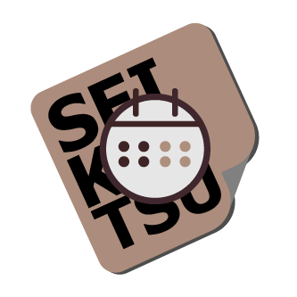

  
  <h3 align="center">Seikatsu-Logger</h3>

## About the Project
- 📂 Open-source
- 🗃️ Locally stored
- 💻 Cross-platform

Activity logger built with flet.

## Features

Manual logging

- [x] Adding, Recording, editing time activity log
- [ ] Time overlapping check
- [x] Note logging

Automatic logging activity
- [ ] Auto log file
- [ ] Activity AI classification

AI Models

- [x] Ollama models inregration

## Installation
## Usage
## License
